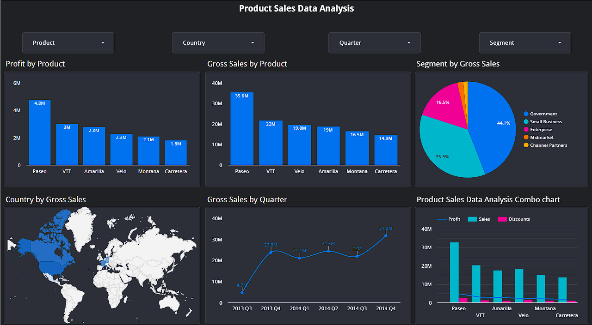

# Product Sales Data Analysis Dashboard

## Project Description:

This project focuses on analyzing product sales data to gain insights into key business metrics and identify factors influencing the company's performance. The primary goal was to create an interactive dashboard using Looker Studio to visualize sales trends, profitability, and regional variations. We aimed to answer critical business questions such as:

- Which products generate the most revenue and profit?
- How do sales vary across regions and seasons?
- Are there specific categories driving overall performance?
- What factors correlate with high or low profitability?

## Tools and Technologies:

- Looker Studio: Used for data visualization and dashboard creation.
- Microsoft Sample Dataset: The source dataset for sales data.
- Google Sheets: Used for data preprocessing and calculation of moving averages.

## Dashboard Components:

The dashboard comprises the following visual elements:

- Profit by Product (Bar Chart): Displays the profit generated by each product, allowing for quick identification of top and bottom performers.
- Gross Sales by Product (Bar Chart): Shows the total sales for each product, highlighting revenue drivers.
- Segment by Gross Sales (Pie Chart): Illustrates the distribution of sales across different product segments.
- Country by Gross Sales (Geo Map): Visualizes sales performance across various countries.
- Gross Sales by Quarter (Line Chart): Depicts sales trends over quarterly periods, highlighting seasonal variations.
- Product Sales Data Analysis Combo Chart (Combo Chart): Compares profit, sales, and discounts for each product.
- Filters: Interactive filters for Product, Country, Quarter, and Segment, enabling users to drill down into specific data subsets.

## Key Findings:

Based on the dashboard visualizations, the following key findings can be observed:

- Product performance varies significantly, with some products generating substantially higher profits and sales than others.
- Sales trends exhibit seasonal patterns, with certain quarters showing increased or decreased activity.
- Product segments contribute differently to overall sales, indicating the importance of focusing on high-performing segments.
- Regional sales variations highlight the need for tailored strategies in different markets.
- There is a visible correlation between the discounts, sales and profit of the products.

  ## Links:

- [Looker Studio Report](https://lookerstudio.google.com/reporting/ef36342e-b2e7-4e76-b548-061b72e83720)
- [Dataset](path/to/dataset.csv)
- [Google Sheets](path/to/sheets.xlsx)

## Files to Include:

- Looker Studio Report (JSON or PDF)
- Dataset (CSV or Excel)
- README.md
- Google Sheets (if applicable)
